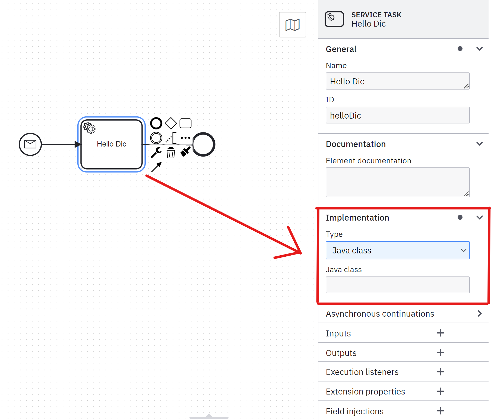

[Prerequisites](prerequisites.md) • **Exercise 1** • [Exercise 1.1](exercise-1-1.md) • [Exercise 2](exercise-2.md) • [Exercise 3](exercise-3.md) • [Exercise 4](exercise-4.md) • [Exercise 5](exercise-5.md)
___

# Exercise 1 - Simple Process
The first exercise focuses on setting up the development environment used in this tutorial and shows how to implement and execute a simple
BPMN process.

With this exercise we will take a look at the general setup of the tutorial code base, modify a service class and execute 
the service within a simple demo process.  

#### Caution: The term `Task` exists in both the FHIR and BPMN domains. We try to make it clear which kind of `Task` we are currently talking about. Please let us know if we missed a spot!

#### Also, make sure you read the [prerequisites](prerequisites.md)!

## Introduction
### Tutorial Code Base Structure and Docker Dev Setup

The tutorial project consists of three parts: A `test-data-generator` project used to generate X.509 certificates and FHIR resources
during the maven build of the project. The certificates and FHIR resources are needed to start the DSF instances which simulate
DSF installations at three different organizations. The DSF instances are configured using 
a `docker-compose.yml` file in the `dev-setup` folder. The docker-compose dev setup uses a single PostgreSQL database server, 
a single nginx reverse proxy as well as three separate DSF FHIR- and DSF BPE server instances. 
The `tutorial-process` project contains all resources (FHIR resources, BPMN process models and Java code) for the actual 
DSF process plugin.

Java code for the `tutorial-process` project is located at `src/main/java`, FHIR resources and 
BPMN process models at `src/main/resources` and prepared JUnit tests to verify your solution at `src/test/java`.

### Process Plugin Main Components

The most important Java class used to specify the process plugin for the DSF BPE server is a class 
that implements the `dev.dsf.bpe.ProcessPluginDefinition` interface from the DSF [dsf-bpe-process-api-v1](https://mvnrepository.com/artifact/dev.dsf/dsf-bpe-process-api-v1) module.

For this tutorial the `TutorialProcessPluginDefinition` class implements this interface.
The DSF BPE server searches for classes implementing this interface using the Java [ServiceLoader](https://docs.oracle.com/en/java/javase/11/docs/api/java.base/java/util/ServiceLoader.html) mechanism. 
Accordingly, the interface is specified in the `src/main/resources/META-INF/services/dev.dsf.bpe.ProcessPluginDefinition` file. 
When creating your own process plugin later, you need to make sure you register your `dev.dsf.bpe.ProcessPluginDefinition` implementation in the same way.

The `TutorialProcessPluginDefinition` class is used to specify *name and version* of the process plugin, which BPMN processes are deployed and what FHIR resources 
are required by the BPMN processes. When deployed, every process plugin exists in its own [Spring context](https://docs.spring.io/spring-framework/reference/core/beans/introduction.html). To make the process plugin work, you have to provide Spring Beans with `prototype` scope for all classes which either extend or implement the following classes/interfaces (as of DSF version 1.4.0 and above): `AbstractTaskMessageSend`, `AbstractServiceDelegate`, `DefaultUserTaskListener` and `ProcessPluginDeploymentStateListener`. We will explore some of these classes later. 

A [Spring-Framework configuration class](https://docs.spring.io/spring-framework/docs/current/reference/html/core.html#beans-java-basic-concepts) located in `spring/config` is expected to provide the Spring Beans. For this plugin, the `TutorialConfig` class will take this role.

The business process engine used by the DSF BPE server is based on the OpenSource Camunda Process Engine 7. In order to specify what Java code should be executed for a BPMN [Service Task](https://docs.camunda.org/manual/7.17/reference/bpmn20/tasks/service-task/) you need to specify the fully-qualified Java class name (e.g. `com.package.myClass`) in the [Service Task](https://docs.camunda.org/manual/7.17/reference/bpmn20/tasks/service-task/) inside the BPMN model. 

If you are using [Camunda Modeler](https://camunda.com/de/download/modeler/), you can find this option after you select a BPMN Service Task: 


The Java class you specified here also needs to extend the `dev.dsf.bpe.delegate.AbstractServiceDelegate` from the DSF dsf-bpe-process-api-v1 module and by extension has to be available as a Spring Bean.

### Process Execution and FHIR Task Resources

Business process instances are started or the execution is continued via [FHIR Task](http://hl7.org/fhir/R4/task.html) resources. The [FHIR Task](http://hl7.org/fhir/R4/task.html) resource specifies what process to instantiate or continue, what organization is requesting this action and what organization is the target of this request. When a BPE instance receives a [FHIR Task](http://hl7.org/fhir/R4/task.html) resource, it finds a fitting BPMN model by parsing the `instantiatesCanonical` element from the  [FHIR Task](http://hl7.org/fhir/R4/task.html) resource and matching it to the BPMN process ID and version. It then adds that [FHIR Task](http://hl7.org/fhir/R4/task.html) resource to the BPMN process execution instance.

The BPMN process execution instance is the in-memory representation of the BPMN diagram you are currently running.
You will have access to all information ([FHIR Task](http://hl7.org/fhir/R4/task.html) resources included) inside this execution instance through the so called [Process Variables](https://docs.camunda.org/manual/7.17/user-guide/process-engine/variables/). 

This construct holds all information accessible to that BPMN process execution. You can see that in `HelloDic#doExecute` you have access to an object called `execution` and an object called `variables`. These two objects provide you with full access to the BPMN process execution and [Process Variables](https://docs.camunda.org/manual/7.17/user-guide/process-engine/variables/). The `variables` object provides you with utility functions for common DSF use cases that do the heavy lifting of searching your way through the very abstract `execution` fields and casting to the correct classes.

*We only recommend you use the `execution` object if the `variables` object isn't sufficient to solve your problem.* In that case we would also like 
to learn how the current API of the `Variables` class is limiting you. Contact us, and we might turn it into a feature request ([Contribute](https://dsf.dev/stable/contribute).

When a [FHIR Task](http://hl7.org/fhir/R4/task.html) resource starts a process we call it "start task", when it continues a process it's called "latest task".
This differentiation is important for multi-instance use cases not covered in this tutorial.

### Process Access Control

[FHIR ActivityDefinition](http://hl7.org/fhir/R4/activitydefinition.html) resources are used to announce what processes can be instantiated at any given DSF instance. 
These resources are used by the DSF to specify what profile the [FHIR Task](http://hl7.org/fhir/R4/task.html) resource needs to conform to and which BPMN message name is required. The BPMN message name is used to map the [FHIR Task](http://hl7.org/fhir/R4/task.html) resource to the correct message event inside the BPMN model.

This mapping process is also called correlation. It will get touched on more in [exercise 3](exercise-3.md). The ActivityDefinition also defines what kind of organization can request the instantiation or continuation of a process instance and what kind of organization is allowed to fulfill the request.

We will take a closer look at ActivityDefinition resources in [exercise 3](exercise-3.md) and [exercise 5](exercise-5.md).

## Exercise Tasks
1. Add a log message to the `HelloDic#doExecute` method that logs the recipient organization identifier from the start [FHIR Task](http://hl7.org/fhir/R4/task.html) resource.

    <details>
        <summary>Don't know where to get a logger?</summary>
    
    This project uses slf4j. So use `LoggerFactory` to get yourself a logger instance.
    </details>
    
    <details>
        <summary>Can't find a way to get the start task?</summary>
    
    The `doExecute` method provides a `Variables` instance. Try it through this one.
    </details>
    
    <details>
        <summary>Don't know where to look for the identifier?</summary>
    
    Take a look at the official [FHIR Task](https://www.hl7.org/fhir/R4/task.html) resource, find elements that have a recipient and manoeuvre your way to those elements using the right getters. Then test which of them has the correct value.
    </details>

2. Register the `HelloDic` class as a prototype bean in the `TutorialConfig` class.
3. Set the `HelloDic` class as the service implementation of the appropriate service task within the `hello-dic.bpmn` process model.
4. Modify the ActivityDefinition for the `dsfdev_helloDic` process to only allow local clients to instantiate the process via a `helloDic` message.

    <details>
        <summary>Can't find the right code?</summary>
    
    Take a look at the [dsf-process-authorization](https://github.com/datasharingframework/dsf/blob/main/dsf-fhir/dsf-fhir-validation/src/main/resources/fhir/CodeSystem/dsf-process-authorization-1.0.0.xml) CodeSystem.
    </details>

## Solution Verification
### Maven Build and Automated Tests
Execute a maven build of the `dsf-process-tutorial` parent module via:
```
mvn clean install -Pexercise-1
```
Verify that the build was successful and no test failures occurred.

### Process Execution and Manual Tests
To verify the `dsfdev_helloDic` process can be executed successfully, we need to deploy it into a DSF instance and execute the process. The maven `install` build is configured to create a process jar file with all necessary resources and to copy the jar to the appropriate locations of the docker dev setup.

1. Start the DSF FHIR server for the `Test_DIC` organization in a console at location `.../dsf-process-tutorial/dev-setup`:
	```
	docker-compose up dic-fhir
	```
	Verify the DSF FHIR server started successfully. You can access the webservice of the DSF FHIR server at https://dic/fhir.  
	The DSF FHIR server uses a server certificate that was generated during the first maven install build. 
    To authenticate yourself to the server you can use the client certificate located at `.../dsf-process-tutorial/test-data-generator/cert/Webbrowser_Test_User/Webbrowser_Test_User_certificate.p12` (Password: `password`). 
    Add the certificate and the generated Root CA to your browser certificate store.
	
	**Caution:** __If you add the generated Root CA to your browsers certificate store as a trusted Root CA, make sure you are 
    the only one with access to the private key at `.../dsf-process-tutorial/test-data-generator/cert/ca/testca_private-key.pem`.__

2. Start the DSF BPE server for the `Test_DIC` organization in a second console at location `.../dsf-process-tutorial/dev-setup`:
	```
	docker-compose up dic-bpe
	```
	Verify the DSF BPE server started successfully and deployed the `dsfdev_helloDic` process. 
    The DSF BPE server should print a message that the process was deployed. The DSF FHIR server should now have a new ActivityDefinition resource. Go to `https://dic/fhir/ActivityDefinition` to check if the expected resource was created by the BPE while deploying the process. The returned FHIR Bundle should contain a single ActivityDefinition. Also, go to `https://dic/fhir/StructureDefinition?url=http://dsf.dev/fhir/StructureDefinition/task-hello-dic` to check if the expected [FHIR Task](http://hl7.org/fhir/R4/task.html) profile was created.

3. Start the `dsfdev_helloDic` process by posting an appropriate [FHIR Task](http://hl7.org/fhir/R4/task.html) resource to the DSF FHIR server:

    The [FHIR Task](http://hl7.org/fhir/R4/task.html) resource is used to tell the DSF BPE server via the DSF FHIR server that a specific organization wants to start (or continue) one process instance at a specified organization. The needed [FHIR Task](http://hl7.org/fhir/R4/task.html) resource can be generated and posted to the DSF FHIR server by executing the `main` method of the `dev.dsf.process.tutorial.TutorialExampleStarter` class.
   
    For the TutorialExampleStarter to work the location of the client certificate and its password need to be specified:
	* Either specify the location and password via program arguments:
		1. location of the client certificate (`.../dsf-process-tutorial/test-data-generator/cert/Webbrowser_Test_User/Webbrowser_Test_User_certificate.p12`),
  		2. password for the client certificate (`password`)
    	* Or set the environment variables `DSF_CLIENT_CERTIFICATE_PATH` and `DSF_CLIENT_CERTIFICATE_PASSWORD` with the appropriate values.
	
    Verify that the  [FHIR Task](http://hl7.org/fhir/R4/task.html) resource could be created at the DSF FHIR server. The TutorialExampleStarter class should print a message `HTTP 201: Created` showing that the [FHIR Task](http://hl7.org/fhir/R4/task.html) resource was created.
	
    Verify that the `dsfdev_helloDic` process was executed by the DSF BPE server. The BPE server should print a message showing that the process was started, print the log message you added to the `HelloDic` class and end with a message showing that the process finished.

___
[Prerequisites](prerequisites.md) • **Exercise 1** • [Exercise 1.1](exercise-1-1.md) • [Exercise 2](exercise-2.md) • [Exercise 3](exercise-3.md) • [Exercise 4](exercise-4.md) • [Exercise 5](exercise-5.md)
